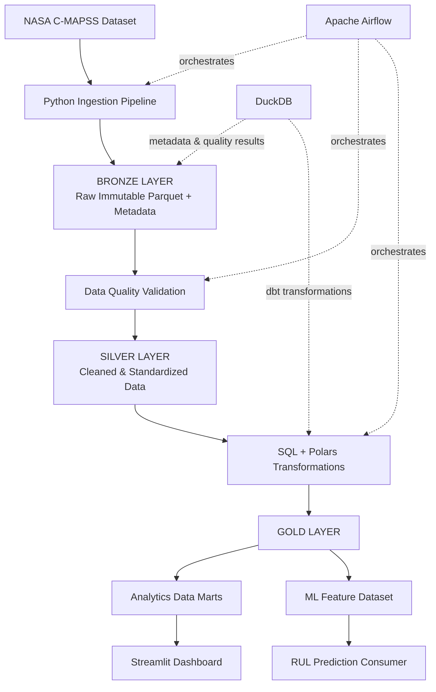
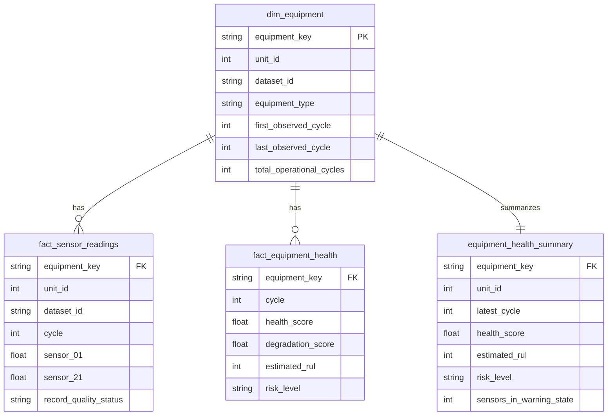

# ⚙️ AssetPulse

**Industrial Sensor Lakehouse & Predictive Maintenance Data Pipeline**

A production-style end-to-end data engineering platform that ingests, validates, transforms, models, and serves NASA C-MAPSS turbofan engine degradation sensor data through a Bronze → Silver → Gold lakehouse architecture.

---

## Problem

Industrial equipment continuously generates operational and sensor data — temperature, pressure, rotational speed, fuel flow, vibration proxies, and more. Raw sensor data is often unreliable: it contains missing readings, duplicate records, invalid values, sensor spikes, and stale datasets.

Predictive maintenance and equipment health models depend on trusted, high-quality time-series datasets. AssetPulse bridges the gap between raw sensor data and actionable analytics by implementing production-grade data engineering patterns.

## Architecture



## Why This Project Exists

Industrial predictive maintenance systems require trusted sensor datasets. Without proper data engineering:
- Models train on dirty data, producing unreliable predictions
- Missing readings and sensor drift go undetected
- Equipment failures are missed because data quality issues mask degradation signals
- Teams cannot answer "which equipment should we inspect first?"

AssetPulse demonstrates how a production data platform solves these problems with idempotent ingestion, automated quality checks, and transparent health scoring.

## Dataset

**NASA C-MAPSS Turbofan Engine Degradation Simulation Dataset**

Run-to-failure data from a fleet of simulated turbofan engines under different operational conditions and fault modes.

| Dataset | Engines (Train) | Engines (Test) | Conditions | Fault Modes |
|---------|-----------------|----------------|------------|-------------|
| FD001   | 100             | 100            | 1          | 1 (HPC)     |
| FD002   | 260             | 259            | 6          | 1 (HPC)     |
| FD003   | 100             | 100            | 1          | 2 (HPC+Fan) |
| FD004   | 249             | 248            | 6          | 2 (HPC+Fan) |

Each record contains: unit ID, operational cycle, 3 operational settings, and 21 sensor measurements.

> **Attribution**: A. Saxena, K. Goebel, "Turbofan Engine Degradation Simulation Data Set", NASA Prognostics Data Repository, NASA Ames Research Center, Moffett Field, CA

## Data Pipeline

### Bronze Layer (Raw Immutable Data)
- Reads C-MAPSS whitespace-delimited source files
- Auto-detects dataset version (FD001–FD004)
- Assigns descriptive column names (unit_id, cycle, sensor_01–21)
- Adds metadata: source_file, dataset_id, ingested_at, pipeline_run_id, source_row_number
- SHA-256 file checksum for idempotent ingestion
- Ingestion manifest prevents duplicate processing
- Writes append-only Parquet

### Silver Layer (Cleaned & Standardized)
- Removes/quarantines duplicates
- Enforces correct data types
- Sorts time-series by (unit_id, cycle)
- Adds quality flags: has_cycle_gap, has_sensor_range_violation, has_sensor_spike
- Assigns record_quality_status: VALID / WARNING / QUARANTINED
- Partitioned Parquet output

### Gold Layer (Analytics & ML-Ready)
- Equipment dimension table (dim_equipment)
- Equipment health fact table with RUL, health scores, risk levels
- Equipment health summary for dashboard
- ML feature dataset with configurable rolling statistics and rate-of-change features

## Data Model



## Data Quality

| Check Type | Description |
|-----------|-------------|
| Schema | Required columns, data types, unexpected columns |
| Completeness | Null detection for critical columns, sensor completeness thresholds |
| Duplicates | Composite key (unit_id, cycle, dataset_id) detection with quarantine |
| Cycle Gaps | Window-style lag per unit_id to find missing operational cycles |
| Sensor Ranges | Configurable min/max per sensor from `config/sensor_ranges.yaml` |
| Freshness | Data age vs configurable thresholds per layer |
| Spike Detection | Rolling mean ± 3σ per sensor per unit with configurable window |

All results are persisted as structured records with check_name, check_type, status (PASS/WARN/FAIL), records_checked, failed_records, failure_percentage.

## SQL Transformations

The project demonstrates advanced SQL through dbt models:

**1. Rolling Sensor Statistics** — `AVG/STDDEV/MIN/MAX OVER (ROWS BETWEEN 9 PRECEDING AND CURRENT ROW)`

**2. Sensor Rate of Change** — `LAG()` to compute cycle-over-cycle sensor deltas

**3. Equipment Degradation Trend** — Rolling averages of rate-of-change over window frames

**4. Equipment Risk Ranking** — `ROW_NUMBER() OVER (ORDER BY health_score ASC)`

**5. Dataset Quality Summary** — CTEs aggregating PASS/WARN/FAIL counts with `CASE WHEN`

## ML Feature Pipeline

Dynamically generates features from `config/features.yaml`:
- Rolling mean/std per sensor per configurable window (5, 10, 20 cycles)
- Rate-of-change features via Polars `diff()`
- Lifecycle features (cycles_since_first_observation)
- Quality summary features (gap_count, warning_count, spike_count)

Output grain: one row per equipment unit per cycle.

## RUL Target

For the run-to-failure training dataset:

```
remaining_useful_life = max_cycle_per_unit - current_cycle
```

> **Important**: This target calculation is valid only for training data where engines run to failure. In production, RUL would be estimated by a trained predictive model — not computed directly from observed data.

## Pipeline Orchestration

Airflow DAG: `assetpulse_sensor_lakehouse_pipeline`

```
start → create_run → check_sources → ingest_bronze → validate_bronze →
transform_silver → validate_silver → generate_ml_features → validate_gold →
update_metrics → end
```

Configured with retries (2), retry delays (5 min), task timeouts (30 min), and failure callbacks.

## Observability

- **Pipeline runs table**: run_id, status, records per layer, quality check counts
- **Task metrics table**: task_name, duration_seconds, records_processed
- **Quality results table**: check_name, check_type, status, failure_percentage
- **Structured JSON logging**: timestamp, log_level, pipeline_run_id, task_name, event

## Dashboard

Streamlit dashboard with 5 pages:
1. **Overview** — Total units, avg health score, quality pass rate, health distribution
2. **Equipment Health** — Per-unit health trend, sensor trends, RUL, risk level
3. **Maintenance Priority** — Equipment ranked by health score
4. **Data Quality** — PASS/WARN/FAIL distribution, failed checks, violations
5. **Pipeline Monitoring** — Run history, task durations, status tracking

## Performance

- **Polars** for all primary DataFrame transformations (vectorized, zero-copy)
- **Parquet** for columnar storage with column pruning
- **Lazy execution** via `scan_parquet` for query optimization and memory efficiency
- **Predicate pushdown** where applicable

## Testing

```
pytest tests/ -v
```

- **56 unit tests** covering schema validation, duplicate detection, cycle gaps, sensor ranges, freshness, health scores, RUL, feature engineering, Bronze-to-Silver transformations
- **1 integration test** running the full pipeline: synthetic data → ingest → validate → silver → gold → verify schemas and row counts
- All tests use temporary directories — no real project data modified

## Local Setup

```bash
# Clone
git clone https://github.com/yourusername/assetpulse.git
cd assetpulse

# Install
pip install -r requirements.txt

# Generate synthetic data (or download real NASA dataset)
python scripts/seed_data.py
# OR: python scripts/download_dataset.py

# Run the pipeline
make pipeline

# Run tests
make test

# Start dashboard
make dashboard
```

## Docker Setup

```bash
docker compose up --build
```

Services: Airflow webserver (:8080), Airflow scheduler, PostgreSQL, Streamlit dashboard (:8501).

## Project Structure

```
assetpulse/
├── airflow/dags/                 # Airflow DAG
├── benchmarks/                   # Pandas vs Polars benchmarks
├── config/                       # YAML configurations
│   ├── development.yaml          # Main config
│   ├── features.yaml             # Feature generation config
│   └── sensor_ranges.yaml        # Sensor range thresholds
├── dashboard/                    # Streamlit app
├── data/                         # Bronze/Silver/Gold data layers
├── dbt/assetpulse/models/       # dbt SQL models
│   ├── staging/                  # Silver → staging views
│   ├── intermediate/             # Rolling metrics, degradation
│   └── marts/                    # Dim/fact tables, summaries
├── src/
│   ├── ingestion/                # C-MAPSS parser, idempotent ingest
│   ├── monitoring/               # Structured logging, run tracking
│   ├── storage/                  # Abstracted storage manager
│   ├── transformations/          # Bronze→Silver, features, health
│   ├── utils/                    # Config, exceptions
│   └── validation/               # Schema, completeness, dupes, gaps,
│                                 # ranges, freshness, spikes
├── tests/
│   ├── unit/                     # 56 unit tests
│   └── integration/              # End-to-end pipeline test
└── scripts/                      # Data download and seeding
```

## Engineering Decisions

| Decision | Rationale |
|----------|-----------|
| **Polars over Pandas** | Vectorized execution, lazy evaluation, better memory efficiency for time-series data |
| **Parquet** | Columnar format enables column pruning and predicate pushdown; efficient for analytical workloads |
| **DuckDB** | Embedded analytical database for metadata, quality results, and dbt transformations — no server required |
| **Bronze/Silver/Gold** | Medallion architecture provides data lineage, quality gates, and clear separation of concerns |
| **Batch processing** | Industrial sensor data is typically collected in batches; matches real-world operational patterns |
| **Config-driven quality checks** | Sensor ranges and thresholds change per deployment; externalized config avoids code changes |
| **Custom validation framework** | Lighter than Great Expectations; tailored to industrial sensor data patterns |

## Production Improvements

The following improvements would be needed for a production deployment (not currently implemented):

- **AWS S3 / GCS** for scalable object storage
- **AWS Glue Catalog** or **Apache Iceberg** for table management
- **Delta Lake** for ACID transactions on data lake
- **Apache Spark** for large-scale distributed processing
- **Apache Kafka** for real-time sensor data streaming
- **Schema Registry** for schema evolution management
- **Managed Airflow** (MWAA, Cloud Composer) for production orchestration
- **Data lineage tools** (OpenLineage, DataHub) for end-to-end traceability
- **Secrets Manager** for credentials management
- **Kubernetes** for container orchestration at scale

## Key Learnings

- Time-series data modeling requires careful attention to ordering, gaps, and windowed computations
- Idempotent ingestion with checksums is essential for reliable batch pipelines
- Data quality should be a first-class pipeline concern, not an afterthought
- Window functions (LAG, LEAD, ROW_NUMBER, rolling aggregates) are the backbone of sensor data analysis
- Configuration-driven feature engineering avoids repetitive code and enables rapid experimentation
- Pipeline observability (run tracking, quality metrics) is critical for operational trust
- Clear separation of Bronze/Silver/Gold layers makes debugging and recovery straightforward

---

**Built as a portfolio demonstration of production-oriented Data Engineering skills for industrial equipment monitoring and predictive maintenance.**
